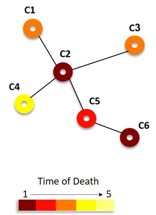

# Explore cell death propogation using PhysiCell

Using PhysiCell version 1.6.0

* begin with a 2-D model
* how many different cell types?
* read initial cell data from .csv files
* cell phenotype properties? cycle, death, volume, motility, etc. 
* create neighbor lists
* create custom data for cells
* create config file (.xml) with relevant <user_parameters>

Rf. /cell_death_data



### Links related to graphs (and possible formats)
* https://networkx.github.io/documentation/stable/index.html
* http://graphml.graphdrawing.org/primer/graphml-primer.html

### Visualizing cells
If you have a Python installation with some required modules for plotting (we recommend Anaconda Python 3.x: https://www.anaconda.com/distribution/), after running your simulation, you should be able to interactively plot the .svg files with (showing the command on a Unix-type command line; alternatively copy the `anim_svg.py` script directly into the `output` folder and run it there):
```
~/git/cell_death_prop/output$ python ../beta/anim_svg.py 
```
and use your keyboard's left/right arrow keys to step through them.
